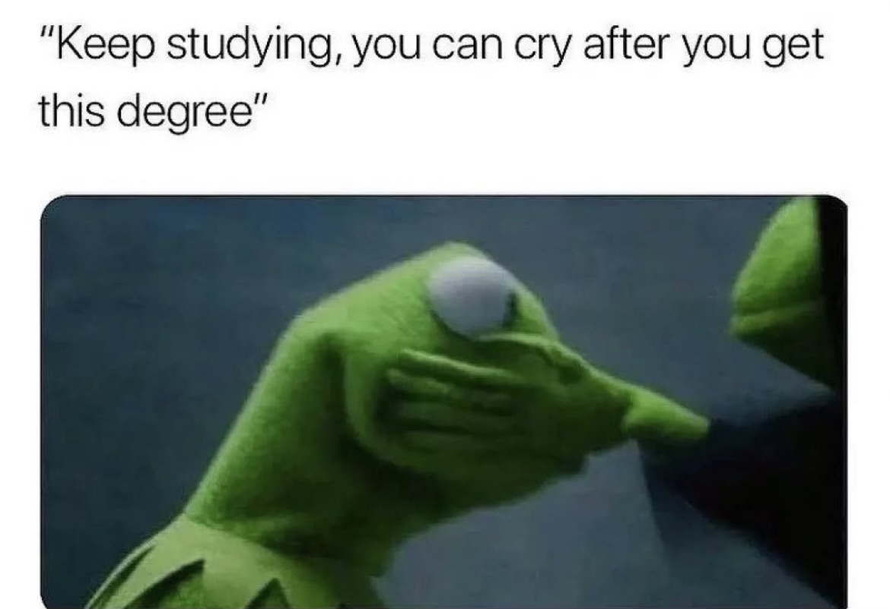
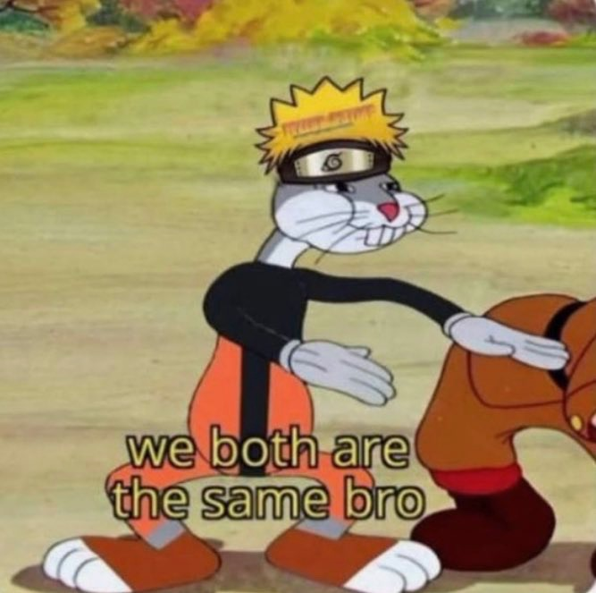

# David Villarreal  

## Academic info
I am an undergrad student majoring in Biology and I am working in **Dr. Amorim's** lab for his research.  
In this research, I am working with human DNA from different regions to see if their mtDNA alters between areas.  
I will be grdauating from **CSUN** in **Spring 2023**  to potentially getting into data analysis.   
## Goals for the semster:  
* Get better at using R 
* Apply for jobs
* Take Python certification exam  
## What I am telling myself this semester:
  

## If you struggle with the coding part of this class just know:  
